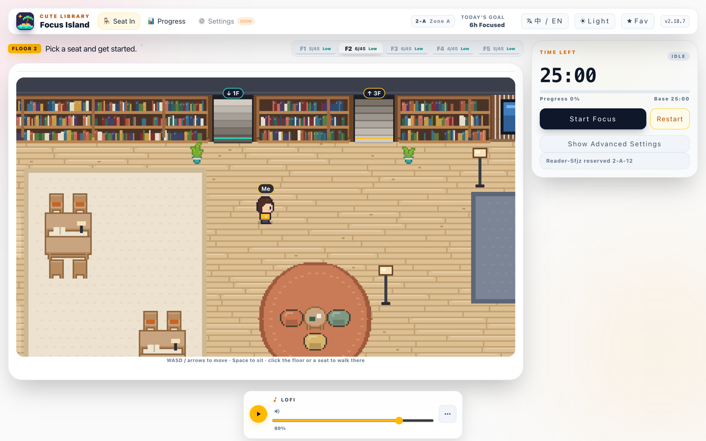
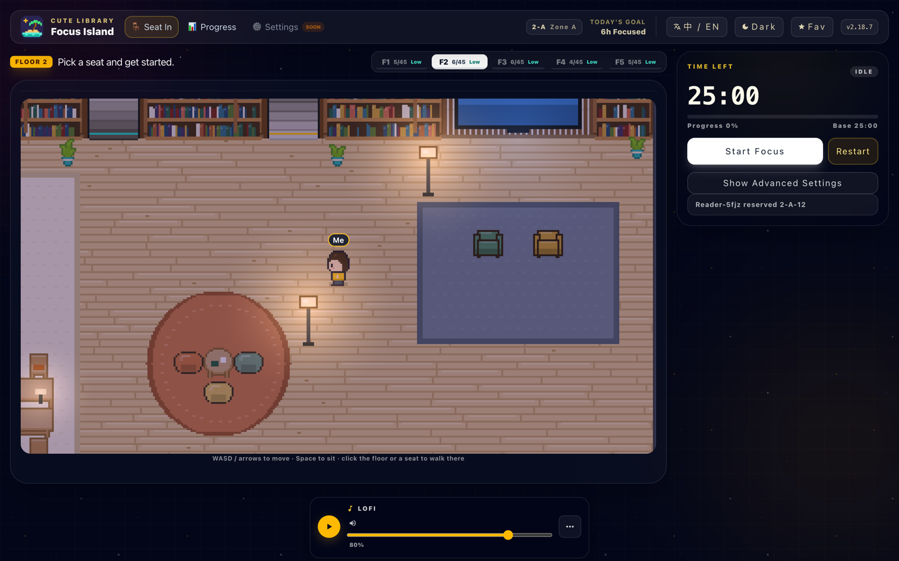
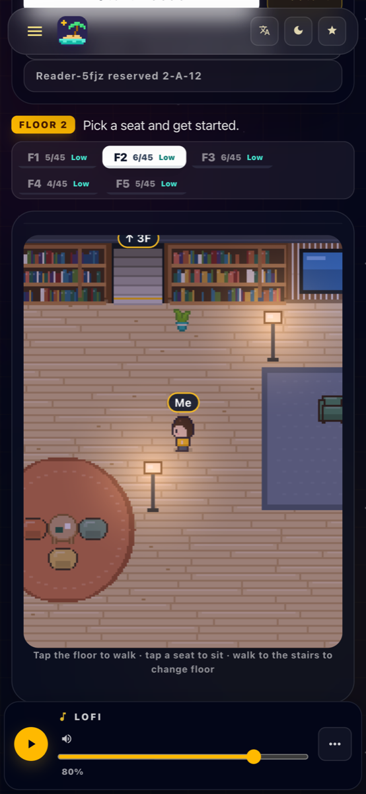
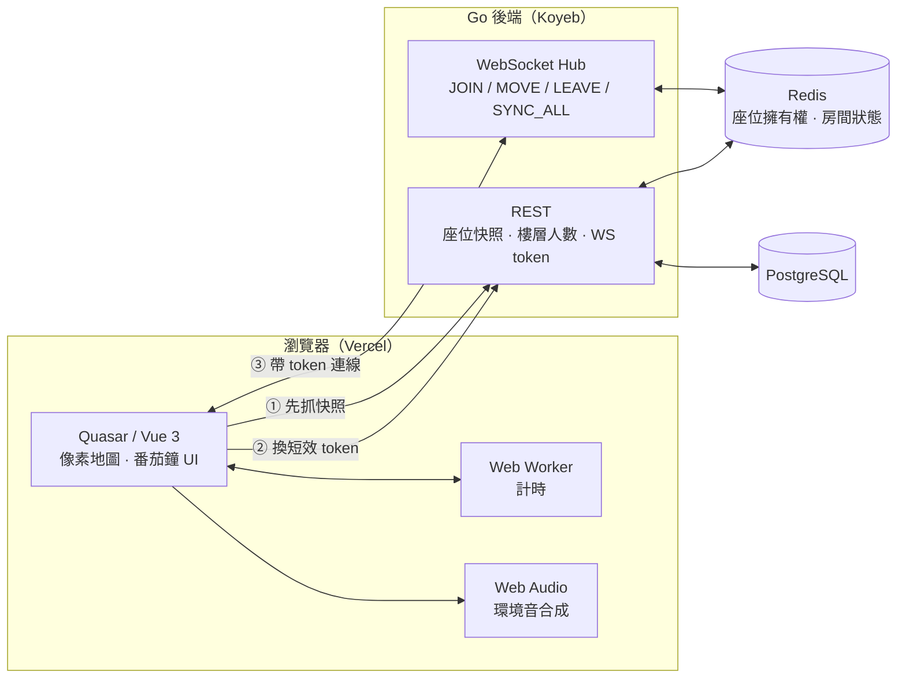

<div align="center">


# Focus Island

**一間 24 小時開著燈的像素風線上自習室。**
挑個位子坐下、按下番茄鐘，跟同一層樓的人一起安靜專注。

[**立即入座 → focus-island.huangyanming.com**](https://focus-island.huangyanming.com/)


</div>

<p align="center">
  
</p>

<table>
  <tr>
    <td width="68%"></td>
    <td width="32%"></td>
  </tr>
  <tr>
    <td align="center"><sub>深色模式是「入夜後開著燈的圖書館」</sub></td>
    <td align="center"><sub>手機上鏡頭會跟著你走</sub></td>
  </tr>
</table>

## 有什麼

- 🪑 **即時座位同步**：誰坐在哪裡、誰剛離開，同一層樓的人都即時看得到。座位以分頁為單位，同一個人開兩個分頁可以各坐一個位子。
- 🧭 **走進圖書館**：Gather 風格的俯視像素地圖。用 WASD／方向鍵走路，或點地板、點座位自動尋路（A*）過去坐下。走到書牆中間的樓梯就能上下樓。
- 📚 **有分區的空間**：自習方桌、懶骨頭區、窗邊吧台、影音區，不是一排排並排的格子。
- ⏱️ **不會被瀏覽器拖慢的番茄鐘**：倒數跑在 Web Worker 裡，切到背景分頁也不會被降頻。可以自動開始下一輪，關掉再回來 20 秒內還能續接。
- 🌧️ **即時合成的環境音**：雨聲、海浪、圖書館底噪、藍調、古典鋼琴用 Web Audio 現場合成，沒有 mp3 循環接縫；另有幾首 Lo-fi 背景音樂。
- 📈 **今日進度**：完成幾輪、累積多少分鐘，每天自動歸零。
- 💾 **記得你在哪**：關掉瀏覽器再回來，會回到上次的樓層、分區，坐著就坐回原位，站著就站回原地。
- 🌗 **細節**：繁中／English 切換、深淺色模式、可安裝的 PWA，以及可以用 iframe 嵌進其他網站的迷你版（`/widget`）。

## 架構



進一個房間的順序是：先用 REST 拿座位快照，再換一張短效的 WebSocket token，最後才建立長連線。WebSocket 只負責快照之後的增量事件，詳細流程寫在 [`WS_SECURITY_FLOW.md`](WS_SECURITY_FLOW.md)。

後端在另一個 repo：[**COMEANC13-backend**](https://github.com/tommy88520/COMEANC13-backend)（Go · Gin · Gorilla WebSocket · Redis · PostgreSQL）。

## 技術重點

| | 做法 |
|---|---|
| 像素地圖 | 2D canvas、整數倍放大、物件依 y 座標排前後；靜態底圖只畫一次，每格只重畫家具與人物 |
| 尋路 | 純邏輯的格子 A*，再把鋸齒路徑拉直；鍵盤移動分軸判斷碰撞，貼牆可以順著滑 |
| 人物 | 16×20 的字元圖 sprite，四方向 × 走路兩格，配色可替換（之後做裝扮用） |
| 名牌 | 在螢幕座標另外畫，字不會跟著像素一起放大變糊 |
| 計時 | `setInterval` 放在 Web Worker，避開背景分頁的計時器節流 |
| 環境音 | 噪音底 + 事件排程在 AudioContext 的時間軸上，自然音沒有循環接縫 |
| 連線 | 單調遞增的 `connectionVersion` 擋掉過期的回呼；心跳 + 斷線延遲重連 |

## 專案結構

```
src/
├─ layouts/MainLayout.vue            # navbar、手機版抽屜、深淺色與語言切換
├─ pages/
│  ├─ IndexPage.vue                  # 選位、番茄鐘、連線流程的主頁
│  ├─ ProgressPage.vue               # 今日進度
│  ├─ WidgetPage.vue                 # 可嵌入的迷你版
│  └─ index/
│     ├─ components/SeatScenePixel.vue   # 像素圖書館（繪製、移動、入座、換樓層）
│     ├─ pixel/pixelMap.ts               # 地圖配置：座位、家具、地毯、樓梯
│     ├─ pixel/pixelArt.ts               # 程式繪製的地板／書牆／人物 + Kenney 圖塊
│     ├─ composables/seatNavigation.ts   # 碰撞與 A* 尋路（純邏輯）
│     ├─ composables/useLibrarySocket.ts # REST 快照 + WebSocket
│     └─ composables/synthAmbience.ts    # Web Audio 環境音合成
├─ stores/pomodoro.ts                # 番茄鐘狀態與今日統計
└─ workers/timer.worker.ts           # 背景計時
```

## 本機開發

需要 Node 22.12 以上。

```bash
npm install
npm run dev        # 開發伺服器，網址會印在終端機
npm run lint
npm run build      # 輸出到 dist/spa
```

在 `.env.local` 設定後端位址（沒設的話，WebSocket 預設連 `ws://localhost:8080`，REST 會從它推出 `http://localhost:8080`）：

```bash
VITE_BACKEND_API_URL=https://your-backend.example.com
VITE_BACKEND_WS_URL=wss://your-backend.example.com
```

部署在 Vercel：Framework 選 `Other`，Build Command `npm run build`，Output Directory `dist/spa`，SPA 路由交給 `vercel.json` 改寫。

## 接下來

- [ ] 角色裝扮：髮色、衣服、配件
- [ ] 同步走路位置，看得到別人在圖書館裡走動
- [ ] 點別人的名牌私訊

## 致謝

- 桌椅、圓桌與盆栽圖塊：[Kenney · Roguelike Indoors](https://kenney.nl/assets/roguelike-indoors)（CC0），授權檔在 [`public/pixel/`](public/pixel/)。
- 書牆、樓梯、地板、懶骨頭、沙發與人物是在 [`pixelArt.ts`](src/pages/index/pixel/pixelArt.ts) 裡用程式畫的。
